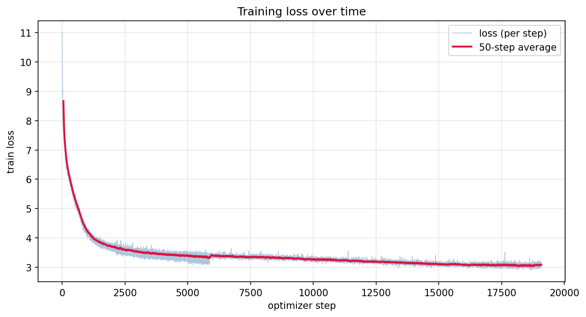

<div align="center">

# Neural Networks: Zero to GPT-2

Building language models from scratch, starting at a character level bigram and ending at a 124M parameter GPT-2 trained on 10 billion tokens.


</div>

<details>
  <summary>Table of Contents</summary>
  <ol>
    <li><a href="#about-the-project">About The Project</a></li>
    <li><a href="#the-models">The Models</a></li>
    <li><a href="#getting-started">Getting Started</a></li>
    <li><a href="#usage">Usage</a></li>
    <li><a href="#the-gpt-2-run">The GPT-2 Run</a></li>
    <li><a href="#what-i-learned">What I Learned</a></li>
    <li><a href="#where-im-stopping-and-why">Where I'm Stopping and Why</a></li>
    <li><a href="#acknowledgments">Acknowledgments</a></li>
    <li><a href="#contact">Contact</a></li>
  </ol>
</details>

## About The Project

This repository is my way through Andrej Karpathy's [Neural Networks: Zero to Hero](https://karpathy.ai/zero-to-hero.html) course, rebuilt in my own words and then pushed further into a full GPT-2 reproduction. It begins with a bigram character model and ends with a 124M parameter GPT-2 trained from scratch on the FineWeb-Edu 10B token sample, including a data pipeline, distributed training, checkpointing, inference, and a Gradio demo.

Every model here was written to understand the mechanics rather than just to run something: manual backprop, batch normalization, residual connections, self attention, byte pair encoding, mixed precision, gradient accumulation, and multi GPU data parallelism.

<div align="center">



GPT-2 124M training loss across roughly 19,072 optimizer steps. Final validation loss is about 3.10.

</div>

### Built With

* [PyTorch](https://pytorch.org/)
* [tiktoken](https://github.com/openai/tiktoken) (GPT-2 byte pair encoding)
* [Hugging Face datasets](https://github.com/huggingface/datasets) (FineWeb-Edu)
* [Gradio](https://www.gradio.app/) (interactive demos)
* [uv](https://github.com/astral-sh/uv) (environment and packaging)
* NumPy, matplotlib
## The Models

The repository follows the same progression as the course, one folder per stage, each building on the last.

| Stage | Path | What it is |
| :--- | :--- | :--- |
| Bigram | [`bigram/`](bigram/) | Character level bigram on a names dataset, both the counting approach and a single layer neural net trained with gradient descent. |
| MLP | [`mlp/`](mlp/) | A Bengio style multilayer perceptron, growing from a basic version to a deeper net, a GPU and DataLoader rewrite, and a BatchNorm variant on Shakespeare characters. |
| RNN / GRU | [`rnn/`](rnn/) | A recurrent net built around a hand written GRU cell. |
| WaveNet | [`wavenet/`](wavenet/) | A hierarchical model that grows its receptive field in a tree, in the spirit of WaveNet. |
| GPT (nanoGPT) | [`gpts/gpt.ipynb`](gpts/gpt.ipynb) | A character level transformer trained on tiny Shakespeare, the "let's build GPT" step: self attention, multi head attention, and residual blocks. |
| GPT-2 124M | [`gpts/train-gpt-2.py`](gpts/train-gpt-2.py) | A from scratch GPT-2 (124M) trained on 10B tokens of FineWeb-Edu, with distributed data parallel training, gradient accumulation, checkpointing, inference, and a live demo. |
## Getting Started

### Prerequisites

* [uv](https://github.com/astral-sh/uv) for the Python environment
* Python 3.13
* An NVIDIA GPU is recommended for the GPT and GPT-2 stages. The smaller models run fine on CPU.

### Installation

1. Clone the repository
   ```sh
   git clone https://github.com/xerneas3318/makemore.git
   cd makemore
   ```
2. Sync the environment
   ```sh
   uv sync
   ```
## Usage

### The notebooks

Open any stage in Jupyter and run it top to bottom.

```sh
uv run jupyter lab
```

The names based models (bigram, mlp, rnn, wavenet) download `names.txt` over HTTP, so they need no local data. The character level GPT reads `data/input.txt` (tiny Shakespeare).

### Names generator demo

The MLP names model ships with a small Gradio demo.

```sh
uv run python mlp/demo.py
```

### Prepare the GPT-2 dataset

This downloads FineWeb-Edu (sample-10BT) and writes tokenized uint16 shards under `data/edu_fineweb10B`.

```sh
uv add datasets
uv run python gpts/fineweb.py
```

### Train GPT-2

Single GPU:

```sh
uv run python gpts/train-gpt-2.py
```

Multiple GPUs on one machine (data parallel):

```sh
uv run torchrun --standalone --nproc_per_node=2 gpts/train-gpt-2.py
```

Training logs go to `logs/train.log`, a loss curve is written to `gpts/loss.png`, and checkpoints land in `data/checkpoints` every 200 steps.

### Generate text

```sh
uv run python gpts/inference.py \
  --prompt "Here is a simple recipe for bread:" \
  --num-samples 4 --max-new-tokens 120 --temperature 0.9 --top-k 50
```

### Interactive GPT-2 demo

```sh
uv run python gpts/app.py            # local, http://localhost:7860
uv run python gpts/app.py --share    # temporary public gradio.live link
```

The demo loads the newest checkpoint from `data/checkpoints`. The trained checkpoint from this project lives on [Hugging Face](https://huggingface.co/Xerneas3318/gpt2-124m-edu-fineweb10b).
## The GPT-2 Run

The final stage reproduces GPT-2 124M end to end.

* **Data:** FineWeb-Edu, sample-10BT, roughly 10 billion tokens, tokenized to 100 uint16 shards (99 train, 1 validation).
* **Model:** 12 layers, 12 heads, 768 embedding dimensions, 1024 context length, weight tied embeddings, flash attention.
* **Training:** bfloat16 autocast, a fixed effective batch of 524,288 tokens held constant through gradient accumulation, cosine learning rate schedule with warmup, gradient clipping at 1.0, and distributed data parallel across GPUs.
* **Infrastructure:** trained on two RTX 5090 GPUs on RunPod, with a babysit script that resumes on failure and a checkpoint every 200 steps so an interruption never costs the whole run.
* **Training time:** roughly 7 hours for the full run, using gradient accumulation to keep the 524,288 token effective batch across the two GPUs.
* **Result:** about 19,072 steps (roughly one pass over the data) to a validation loss near 3.10.
## What I Learned

Working through every stage by hand, the ideas that stuck:

* How a loss function and manual backprop actually move weights, before any autograd.
* Why initialization, BatchNorm, and residual connections matter for training deep nets.
* The full transformer: self attention, causal masking, multiple heads, and the block structure.
* Byte pair encoding and why token level modeling scales past character level.
* Practical training at scale: mixed precision, gradient accumulation to hit a large effective batch on a small card, learning rate schedules, and gradient clipping.
* Distributed data parallel training, how gradients sync across GPUs, and how sharding and checkpointing keep long runs safe.
* The full lifecycle: dataset preparation, cloud training, resuming from checkpoints, inference, and shipping a demo.
## Where I'm Stopping and Why

Reproducing GPT-2 124M was the goal of this series, and it is done. I am choosing to stop here rather than keep tuning this model further.

I could push the validation loss lower with more tokens, longer schedules, or hyperparameter sweeps, but the returns would be incremental and the architecture is now several years old. I think my time is better spent building a more modern architecture from what I learned here, since that is closer to where the field actually is and should be more valuable to work through. Reproducing a 2019 model taught me the fundamentals; the natural next step is to apply them to current designs (things like rotary position embeddings, RMSNorm, SwiGLU, grouped query attention, and modern training recipes) rather than to keep polishing GPT-2.
## Acknowledgments

* [Andrej Karpathy, Neural Networks: Zero to Hero](https://karpathy.ai/zero-to-hero.html), including [makemore](https://github.com/karpathy/makemore), [nanoGPT](https://github.com/karpathy/nanoGPT), and [build-nanogpt](https://github.com/karpathy/build-nanogpt). This project follows that course closely.
* [Best-README-Template](https://github.com/othneildrew/Best-README-Template) by othneildrew, which this README is based on.
* [FineWeb-Edu](https://huggingface.co/datasets/HuggingFaceFW/fineweb-edu) by Hugging Face, the training data for GPT-2.
* [RunPod](https://www.runpod.io/) for the cloud GPUs, and [Gradio](https://www.gradio.app/) for the demos.
## Contact

xerneas3318 on [GitHub](https://github.com/xerneas3318)

Project link: [https://github.com/xerneas3318/makemore](https://github.com/xerneas3318/makemore)